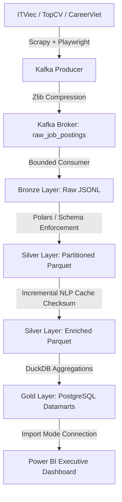

# 🇻🇳 Real-Time Data/AI Job Market Intelligence Platform in Vietnam

---

#### 📖 Project Overview

This project implements a **Modern Data Stack (MDS)** pipeline to ingest, transform, and visualize real-time job postings for Data/AI roles in Vietnam. It demonstrates how to build a scalable, automated data platform from scratch—bypassing Cloudflare WAFs, streaming unstructured HTML payloads through **Apache Kafka**, storing data in a **Medallion Lakehouse (Polars & Parquet)**, extracting key dimensions with a custom **Incremental NLP engine**, and loading optimized datamarts into **PostgreSQL** to feed a 3-page executive **Power BI** dashboard.

##### Key Features

- **WAF-Bypassing Crawlers**: Multi-source scraping using **Scrapy & Playwright** (Chromium Engine) to handle dynamic JS-rendering and bypass Cloudflare TLS Fingerprint protections.
- **Event Streaming Buffer**: **Apache Kafka (KRaft mode)** acts as a message broker to queue dynamic payloads, utilizing custom **zlib (level 9) + Base64 compression** to reduce raw HTML sizes by **10x** (~2MB to ~200KB).
- **High-Performance Storage**: Clean data is saved in **Parquet (Snappy-compressed)** format, reducing local storage footprint by **over 90%** and boosting analytical queries by **~100x** via Polars LazyFrames.
- **Incremental NLP Feature Extraction**: A high-speed **Longest-Match-First with Text Masking** algorithm bóc tách skills, seniority, and salaries with an outstanding **96.36% F1-Score**, reducing CPU load by **60-80%** via content MD5 hashing.
- **Orchestration & Containerization**: **Apache Airflow** schedules the entire E2E pipeline, orchestrated via **DooD (Docker-outside-of-Docker)** over Docker Socket to minimize RAM overhead.
- **Data Warehouse & Corporate BI**: 4 specialized Gold datamarts in **PostgreSQL** serve an executive-level, 3-page **Power BI** dashboard built on business storytelling.

---

#### 🛠️ Tech Stack & Architecture

| Layer                       | Component               | Technology             | Description                                                                                    |
| :-------------------------- | :---------------------- | :--------------------- | :--------------------------------------------------------------------------------------------- |
| **Ingestion**               | Web Scraping / Anti-bot | 🕷️ Scrapy + Playwright | Fetches live Data/AI jobs from ITViec, TopCV, and CareerViet, bypassing TLS/WAF.               |
| **Streaming Buffer**        | Message Broker          | 🐎 Apache Kafka        | Decouples Crawlers from storage, absorbing traffic spikes and handling backpressure.           |
| **Storage (Bronze/Silver)** | Medallion Lakehouse     | ❄️ Parquet + Polars    | Stores raw JSONL (Bronze) and cleaned Parquet (Silver) structured via Hive-style partitioning. |
| **Orchestration**           | Workflow Scheduler      | 🌬️ Apache Airflow      | Orchestrates Scrapy -> Kafka -> Consumer -> Silver Parser -> NLP -> Gold Loading.              |
| **Transform (Gold)**        | Datamart Aggregations   | 🦆 DuckDB              | Performs hyper-fast out-of-core SQL aggregations to create analytical models.                  |
| **Serving Layer**           | Data Warehouse          | 🐘 PostgreSQL          | Hosts the production datamarts (`gold` schema) for downstream BI consumers.                    |
| **Visualization**           | Executive Dashboard     | 📊 Power BI            | Connects to PostgreSQL (Import Mode) to deliver actionable market insights.                    |
| **Infrastructure**          | Containerization        | 🐳 Docker & Compose    | Packages 5 core services running on a unified internal network (`de_network`).                 |

---

#### 📂 Project Structure

```text
.
├── docker-compose.yml           # Unified services setup (Kafka, Postgres, Airflow, App)
├── Dockerfile                   # Isolated Python development environment with Chromium
├── requirements.txt             # Py-libraries (Polars, DuckDB, kafka-python-ng, psycopg2)
├── .env.example                 # Environment variables blueprint
├── logs/                        # Centralized execution and schema drift error logs
├── data/                        # Local Medallion Lakehouse storage
│   ├── bronze/                  # Raw JSON Lines organized by source and crawl date
│   │   └── <source_name>/year=YYYY/month=MM/day=DD/jobs_raw.jsonl
│   ├── silver/                  # Cleaned, structured Parquet files (Hive partitioned)
│   │   └── year=YYYY/month=MM/jobs_cleaned.parquet
│   └── gold/                    # Analytical Parquet snapshots generated by DuckDB
├── src/
│   ├── crawlers/                # Scrapy + Playwright Project
│   │   └── job_crawler/
│   │       ├── settings.py      # Autothrottle, concurrent limits & pipeline bindings
│   │       ├── pipelines.py     # Custom Kafka Producer with zlib + Base64 compression
│   │       └── spiders/         # itviec_spider, topcv_spider, careerviet_spider
│   ├── transformers/            # Core processing and ETL code
│   │   ├── silver_parser.py     # DOM Parser with Schema Drift resilience (Try-Except logging)
│   │   ├── nlp_extractor.py     # Text-Masking NLP parser with Incremental Cache Checksums
│   │   ├── gold_builder.py      # DuckDB compiler for Gold Datamarts
│   │   └── evaluate_nlp.py      # Independent ML assessment framework (Precision, Recall, F1)
│   └── dags/
│       └── job_market_pipeline.py # Airflow DAG executing E2E tasks via DooD Docker Socket
└── docs/
    └── dashboard/
        └── IT_Job_Market_Dashboard.pbix # 3-page Power BI executive-level report
```

---

#### 🚀 Getting Started

##### 1. Prerequisites

- [Docker](https://www.docker.com/) & [Docker Compose](https://docs.docker.com/compose/)
- [WSL2](https://learn.microsoft.com/en-us/windows/wsl/install) (Mandatory for Windows users)
- [Git](https://git-scm.com/) (To clone the repository)
- [Power BI Desktop](https://powerbi.microsoft.com/) (To view and refresh the interactive dashboard)

##### 2. Manual Step-by-Step Setup

**Step A: Clone and Prepare Environment**

```bash
git clone https://github.com/23520124/job-market-intelligence.git
cd job-market-intelligence
cp .env.example .env
```

_Edit `.env` to configure your PostgreSQL credentials and Airflow configurations._

**Step B: Spin up Infrastructure**

```bash
docker compose up -d --build
```

_This starts the 5 core services: PostgreSQL (`de_postgres`), Kafka with KRaft (`de_kafka`), Airflow Webserver, Airflow Scheduler, and the main App container._

**Step C: Execute Pipeline**

1. Access the Airflow UI at `http://localhost:8080`.
2. Locate the `vietnam_job_market_pipeline` DAG.
3. Turn on and trigger the DAG. Airflow will sequentially run:
   - `Crawl Task`: Launches Scrapy Spiders -> Streams compressed HTML payloads to Kafka.
   - `Consumer Task`: Runs the Bounded Consumer, saving sequential `.jsonl` files to Bronze.
   - `Silver & NLP Task`: Parses raw HTML to Parquet and enriches it using the NLP parser.
   - `Gold Task`: DuckDB aggregates Silver Parquet files and loads them into PostgreSQL.

---

#### 🔗 Monitoring & Access

| Service                | URL                                                       | Credentials (Default)            |
| :--------------------- | :-------------------------------------------------------- | :------------------------------- |
| **Airflow Webserver**  | `http://localhost:8080`                                   | `admin` / `admin`                |
| **PostgreSQL DB**      | `localhost:5432` (db: `de_database`)                      | `admin` / `your_secure_password` |
| **Kafka Bootstrap**    | `localhost:9092` (External) / `de_kafka:29092` (Internal) | _No Authentication_              |
| **Power BI Dashboard** | Open `docs/dashboard/IT_Job_Market_Dashboard.pbix`        | Connects via `localhost:5432`    |

---

#### 📊 Data Pipeline Flow & Scale

The pipeline is modeled as a unified Medallion architecture, handling automated ingestion and transformation:



1.  **Bronze Layer (Raw)**: Ingests raw HTML pages containing job details. Payload compression (**zlib level 9**) reduces Kafka transport volume by **10x** (~2MB to ~200KB). Files are organized under: `data/bronze/<source_name>/year=YYYY/month=MM/day=DD/`.
2.  **Silver Layer (Staging & Enrichment)**:
    - **Parsing**: Polars reads Bronze files, parses elements resiliently (with full try-except logs protecting against layout changes), and writes to columnar **Parquet** format (**90% disk space saved, 100x query speedup**).
    - **NLP Extraction**: Processes unstructured text using a **Longest-Match-First with Text Masking** algorithm to identify skills, seniority levels, and salaries with a verified **96.36% F1-score**. Incremental logic skips processed records by hashing `job_id` + `content_checksum`, **saving 60-80% CPU**.
3.  **Gold Layer (Datamarts)**: DuckDB aggregates enriched Parquet data and loads it into 4 production PostgreSQL tables:
    - `gold.salary_by_seniority`: Grouped metrics for salary trends across seniority and regions.
    - `gold.top_skills_by_role`: Market demand percentages for skills in DE, DA, and AI roles.
    - `gold.skill_cooccurrence`: Frequency matrix of co-occurring technologies (e.g., Docker + K8s).
    - `gold.weekly_skill_trends`: Weekly historical tracking of job counts to separate new vs. backlogged demand.
4.  **Serving**: Power BI Desktop queries PostgreSQL using **Import Mode** (storing aggregated data in RAM for sub-second visual responsiveness) to deliver insights.

---

#### 📈 Sample Queries for Data Analysts (Serving Layer)

DEs build, DAs consume. Below are optimized query examples targeting the PostgreSQL Gold schemas:

- **Query 1: Top 5 tech stack combinations (Co-occurrence)**
  ```sql
  SELECT skill_a, skill_b, pair_frequency
  FROM gold.skill_cooccurrence
  ORDER BY pair_frequency DESC
  LIMIT 5;
  ```
- **Query 2: Average Seniority salaries for Data Engineers in HCM**
  ```sql
  SELECT seniority_level, min_salary_avg, max_salary_avg
  FROM gold.salary_by_seniority
  WHERE job_role = 'Data Engineer' AND location = 'Ho Chi Minh'
  ORDER BY max_salary_avg DESC;
  ```

---

#### 🖼️ Screenshots Gallery

##### 1. Medallion Pipeline Architecture (DooD & Event Streaming)

_(Insert your Mermaid System Architecture Diagram here)_

##### 2. Apache Airflow E2E DAG Execution

_(Insert screenshot of vietnam_job_market_pipeline DAG with all green states)_

##### 3. Power BI Executive Dashboard

_(Insert screenshots of your 3-page Power BI Dashboard: Salary, Skills Heatmap, and Weekly Trends)_

---

_Author: **Nguyen Ngoc Duy Bao** - Built with First-principles & Production-ready Data Engineering Standards._
